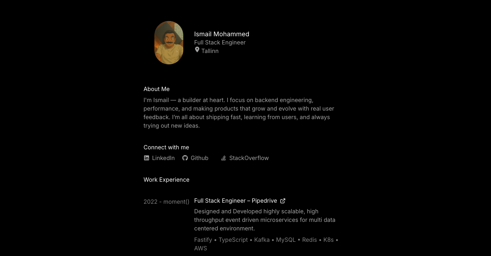

## Analytics

- [Google Analytics - Traffic acquisition](https://analytics.google.com/analytics/web/#/p502191192/)
- [Vercel Analytics](https://vercel.com/ismailmmds-projects/ismailm/analytics)

## Development

Clone and run the development server:

```bash
npm i
npm run dev
```

Open [http://localhost:3000](http://localhost:3000) with your browser to see the result.

You can start editing the page by modifying `pages/index.js`. The page auto-updates as you edit the file.
